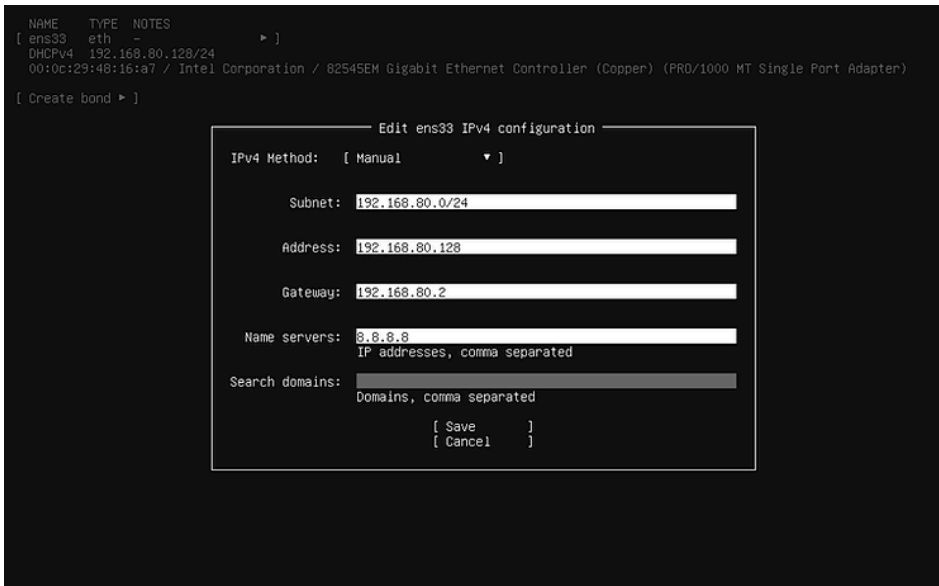
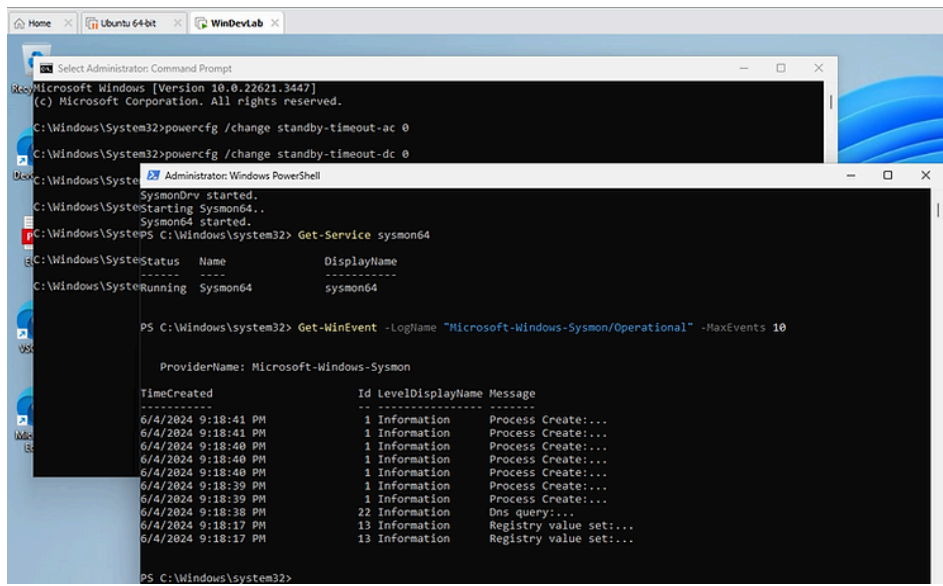

# 🧪 Home Lab Setup – VMware Cybersecurity Lab

This project documents the step-by-step process of setting up a functional cybersecurity home lab using VMware, Windows 11, Ubuntu Server, and tools like Sysmon, LimaCharlie, and Sliver. This lab is the foundation for later simulated attacks and endpoint detection/response experiments.

---

## 🎯 Objectives

- Build a functional Windows/Ubuntu-based home lab
- Configure networking and hardware settings
- Prepare the Windows VM for attack simulation and telemetry collection
- Set up EDR visibility with LimaCharlie
- Deploy a Sliver C2 server and execute a basic payload test

---

## 🧰 Tools & Technologies

- **VMware Workstation Player**
- **Windows 11 VM** and **Ubuntu Server (Live)**
- **Putty SSH Client**
- **Sliver C2 Framework**
- **Sysmon** (via PowerShell)
- **LimaCharlie** (EDR Sensor)

---

## ⚙️ Key Configuration Steps

- Created and configured both Ubuntu and Windows VMs
- Manually resolved Hyper-V conflicts and Virtualization-Based Security issues
- Installed Sysmon and configured event logging
- Set up and tested LimaCharlie EDR
- Generated and deployed a C2 payload via Sliver to the Windows VM

---

## 🖼️ Screenshots

| Setup Stage                       | Screenshot |
|----------------------------------|------------|
| Ubuntu Static IP Configuration   |  |
| Sysmon Event Log Verification    |            |

---

## 📄 Repo Contents

| File / Folder       | Description                                  |
|---------------------|----------------------------------------------|
| `report.md`         | Full lab write-up and step-by-step process   |
| `/Images/`          | Screenshots from system setup and testing    |
| `Step-by-Step Home Lab.pdf` | Original version of the report             |

---

## 🧠 Lessons Learned

- Deep troubleshooting of VM/hypervisor conflicts
- Manual configuration of Windows security policies and Sysmon
- Basic C2 server deployment and payload testing
- How to collect telemetry and prepare for detection logic

---

## ✅ Next Steps

- Continue to simulate real-world attacks  
- Build detection rules in LimaCharlie  
- Expand lab into multi-host architecture with Active Directory

