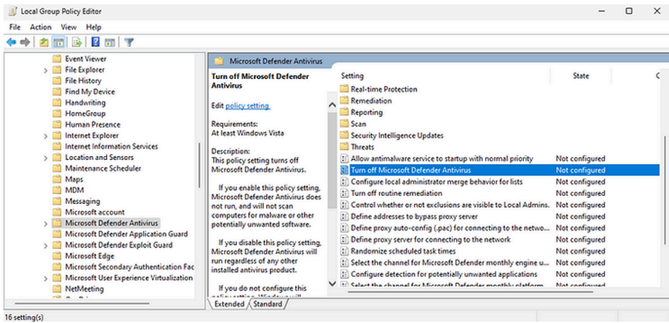
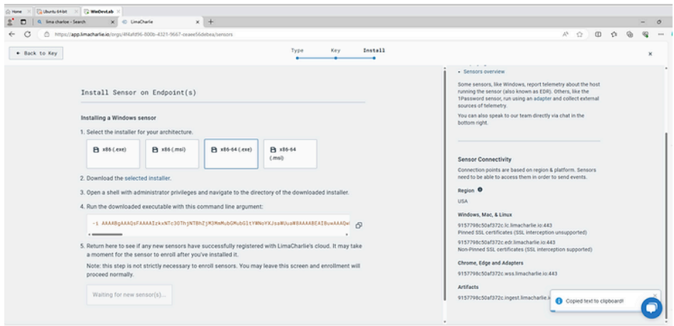
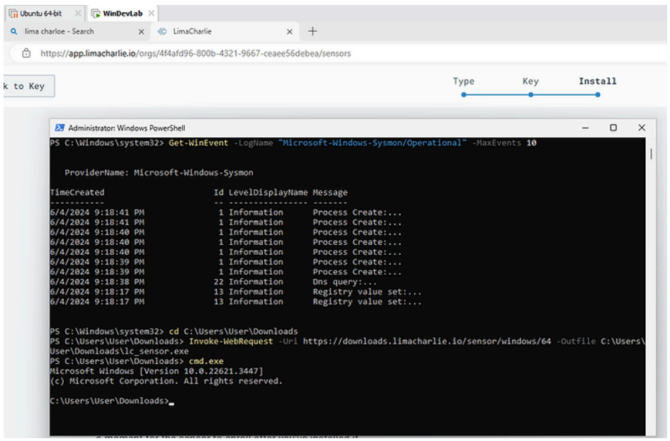
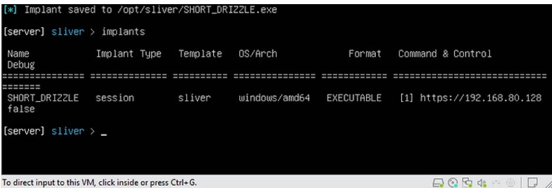

# 🧪 Home Lab Setup – Windows 11 & Ubuntu with LimaCharlie EDR

**Author:** Siraj Abdul-Shahid  
**Date:** 07/04/2024

This document outlines the process of building a cybersecurity home lab using VMware Workstation, a Windows 11 virtual machine, and Ubuntu Server. The goal was to prepare a working environment for endpoint detection and response (EDR) experimentation using LimaCharlie, Sysmon, and the Sliver command-and-control (C2) framework.

---

## 🧱 1. Lab Overview

- Hypervisor: VMware Workstation Player  
- VMs used: Windows 11, Ubuntu Server  
- Key tools: Sysmon, LimaCharlie, Sliver, Putty  
- Focus: Network setup, security policy tuning, C2 deployment, EDR installation

---

## 🖥️ 2. Creating the Ubuntu VM

- Selected Ubuntu (Live) image  
- Named the VM and set default location  
- Used default disk setup  
- Finalized installation and rebooted  

### Static IP Configuration in Ubuntu

```bash
ip a
sudo nano /etc/netplan/00-installer-config.yaml
````

* Set up static IP address (e.g., `192.168.174.137`)
* Confirmed settings with:

```bash
ip a
ping 8.8.8.8
```


---

## 🪟 3. Creating the Windows 11 VM

* Downloaded and extracted a Windows 11 Enterprise ISO image
* Removed virtual floppy disk from VM settings
* Configured networking and memory
* Verified installation success

---

## 🧰 4. System Configuration Tasks

### Disabled Microsoft Defender (for testing purposes)

* Accessed group policies:

```bash
gpedit.msc
```

* Navigated to:
  `Computer Configuration > Administrative Templates > Windows Components > Microsoft Defender Antivirus`
* Disabled real-time protection



---

### Enabled Sysmon for Process Logging

* Downloaded Sysmon from Microsoft’s Sysinternals Suite
* Ran PowerShell as administrator:

```powershell
Sysmon64.exe -accepteula -i
```


---

## 🔗 5. Installing and Connecting LimaCharlie

* Registered for a LimaCharlie account
* Created a sensor for Windows and downloaded the installer
* Installed the sensor on the Windows VM
* Verified telemetry reporting in the LimaCharlie dashboard

  


---

## 🧠 6. Sliver Payload Setup

* Used Ubuntu terminal to install and launch Sliver C2 framework
* Created a basic payload targeting the Windows VM:

```bash
generate --os windows --format exe --sleep 5s
```

* Transferred payload via USB to Windows VM
* Ran the payload and established a session in Sliver



---

## 🧪 7. Outcome

* Successfully simulated the full stack: host creation, configuration, Sysmon logging, EDR connection, and payload delivery
* Established a clean environment for further security experimentation

---

## ✅ Next Steps

* Add MITRE ATT\&CK technique mapping to payloads
* Begin generating real-world attack telemetry for analysis
* Build out detection logic in LimaCharlie
* Expand to include Active Directory + multi-host segmentation
